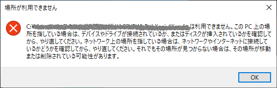

Windowsのショートカットのリンク先を書きかえたい、PowerShellでバッチ的に書きかえよう
==============

# 解決すべき問題

## そもそも何が問題だったかというと

自分が関わる開発プロジェクトのSubversionレポジトリをGitHub Enterpriseへ移行する作業を始めた。そのプロジェクトはWindowsを前提しており、ファイルツリーのなかに数百個のショートカットがあった。ショートカットには属性としてリンク先があって、フォルダのパスが絶対パスで書いてあった。たとえば `C:\SVNReposX\contents\aaaa\code` のように。わたしはGitレポジトリを `C:\GheReposX` の下に作ってSubversionからコンテンツを移行した。このままではショートカットのリンク先が `C:\SVNReposX\...` だ。このままではまずい。というのもWindowsエクスプローラーでショートカットをダブルクリックすると下記のようなエラーになったから。



SubversionからGitに移行したプロジェクトのなかにあるショートカットのリンク先を `C:\SVNRepos` で始まる文字列から `C:\GheReposX` で始まる文字列に書き換えなければならない。

## 要素問題

1. あるフォルダの下にあるショートカット（ファイル名の末尾が`.lnk`であるファイル）を一括して取得したい
2. ショートカットを読んでリンク先がいまどういう値に設定されているかを調べたい。
3. リンク先に含まれる或る文字列を別の文字列に置換したい
4. 置換後のリンク先を持つショートカットをファイルにWRITEしたい。
5. 置換後のリンク先がファイルないしディレクトリとして実際に存在するかどうかを調べ、もしも存在しなければ警告メッセージを出力したい
5. ツールにはdry runモードを持たせたい。つまりショートカットを列挙してリンク先をどう書き換えるかの計算まで実行するが、ただしショートカットを更新することは差し控えるという動きを実現したい。デバッグするのに便利だから。

## 絶対パスか相対パスか

そもそもショートカットのリンク先に絶対パスを書くと融通がきかないから、ショートカット自身を基底とする相対パスを書くべきだ、という考えもあった。スクリプトを駆使してリンク先を編集し相対パスにすることは可能性だ。

- [相対パスの指定方法](https://dulunoj.com/2018/02/13/%E7%9B%B8%E5%AF%BE%E3%83%91%E3%82%B9%E3%81%AE%E6%8C%87%E5%AE%9A%E6%96%B9%E6%B3%95/)

しかしながらショートカットを新規に作るにはふつうWindowsのエクスプローラーで右クリックして *新規作製 > ショートカット* とやるが、そのやり方では **リンク先に必ず絶対パスが設定される。** ふつうのやり方でショートカットのリンク先に相対パスを指定することはできない。だからショートカットを相対パスで指定するというやり方は可能ではあるがじっさい運用できないといわざるをえない。

いまわたしがショートカットのリンク先を書きかえるツールを作るあたって、絶対パスを相対パスに書きかえるのではなく、与えられた絶対パスを別の絶対パスに書きかえることができるツールを作るほうが実用的だと考えた。

# 解決方法

PowerShellでスクリプトを書こう。ぜんぶ解決できる。

# 説明

## ソースコードの在りか

- [src/main/powershell/ConvertShortcutTargetPath.psm1](src/main/powershell/ConvertShortcutTargetPath.psm1) : Convert-ShortcutTargetPath関数の実装
- [src/main/powershell/batch.ps1](src/main/powershell/batch.ps1) : あるフォルダの下にあるショートカット群にたいしConvert-ShortcutTargetPath関数を適用してリンク先を書きかえるPowerScript
- [src/test/powershell/ConvertShortcutTargetPath.Tests.ps1](src/test/powershell/ConvertShortcutTargetPath.ps1) : Convert-ShortcutTargetPath関数をユニットテストするコード by Pester

## 環境

- Windows 10 Pro
- .NET Framework (ver 4.7.03190)
- PowerShell (プログラミング言語)
- Visual Studio Code (エディタ　ver 1.41)
- Pester (PowerShellのユニット・テストframework)

## テストをどうやって実行するか

Visal Studio CodeのTerminalを使う。

```
PS C:\...\EditingWindowsShortCutsUsingPowerShell> Invoke-Pester
```

## バッチ処理をどうやって実行するか

Visual Studio CodeのTerminalを使う。

```
PS C:\...\EditingWindowsShortCutsUsingPowerShell> src/main/powershell/batch.ps1
```


# 参考にした情報

## PowerShell言語に組み込まれたPathにかんするコマンドレット

- [@IT WindowsのPowerShellでパス文字列を操作する](https://www.atmarkit.co.jp/ait/articles/0809/12/news139.html)
- [Convert-Path カレントフォルダを基点として、与えられた相対パスを絶対パスに変換する](https://forsenergy.com/ja-jp/windowspowershellhelp/html/60cd1f85-c580-454a-8df5-f8ec4ce44a34.htm)
- [Join-Path パスと子パスを結合する](https://forsenergy.com/ja-jp/windowspowershellhelp/html/2c0230a1-fe6b-40f5-8fd2-926ce631b402.htm)
- [Split-Path パスの要素を返す](https://forsenergy.com/ja-jp/windowspowershellhelp/html/efafd4b3-e5cf-4899-b693-3b4a0d91d01a.htm)
- [Test-Path パスのすべての要素が存在するかどうかを確認する](https://forsenergy.com/ja-jp/windowspowershellhelp/html/bce28e12-dc29-4ffd-8f1c-28f877931ebf.htm)
- [Resolve-Path ](https://forsenergy.com/ja-jp/windowspowershellhelp/html/69809773-ce6e-4128-9526-3eaf4b5dc6d5.htm)
- [Pesterを使ったPowerShellモジュールのテスト駆動開発](https://qiita.com/yuki451/items/68d4b1f0bc235f7f318d)
- [PowerShellで絶対パスと相対パスを相互変換したい](https://qiita.com/yumura_s/items/0aed4c275432993e9174)
- [PowerShell フォルダ内のファイル一覧を取得し、一括でファイル操作を行う](https://mseeeen.msen.jp/how-to-get-list-of-files-in-folder-with-powershell/)


# 困ったことと解決方法

## BOM無しのUTF-8で作った.ps1ファイルを実行したら日本語が文字化けした

.ps1ファイルをPesterで実行したらPesterが出力したメッセージのなかの日本語文字が化けてしまった。ファイルの文字エンコーディングがBOM無しのUTF-8になっている。.ps1ファイルはUTF-8 BOMつきでなければならないようです。

下記の記事を参考に、あるフォルダ配下のすべての.PS1ファイルをBOM有りUTF-8に変換するPowerShellスクリプトを用意して実行した。

- [WindowsですべてのUTF-8ファイルにBOMを付ける、たったひとつの冴えたやり方](https://qiita.com/aokomoriuta/items/b1182d310ec4ef2d76b7)

```
get-childitem * -include *.ps1,*.psm1 -Recurse | foreach-object {((&{if ((Compare-Object (get-content $_.FullName -encoding byte)[0..2] @(0xEF, 0xBB, 0xBF)).length -eq 0){ @() } else { ([byte[]] @(0xEF, 0xBB, 0xBF)) } }) + (get-content $_.FullName -encoding byte)) | set-content $_.FullName -encoding byte}
```

### 訂正 at 28 Jan, 2020

いままでわたしは Windows PowerShell 5.1 を使っていた。v5.1までは*.ps1ファイルの文字エンコーディングのデフォルト値がUTF-8 BOMつきだった。BOM無しUTF-8で作られた*.ps1ファイルをPesterが実行したときにそれがUTF-8 BOMつきであるはずだと誤解した結果、メッセージの文字化けが発生した。

きのう習ったのだがPowerShell Core 6がとっくにリリースされていて今後はこれが本流であり、Windows PowerShell 5.1はいずれ廃れる運命にある。PowerShell v6では*.ps1ファイルの文字エンコーディングがBOM無しのUTF-8に変更された。だからPowerShell v6を使うかぎりはすべてのテキストファイルをBOM無しUTF-8で統一することができる。これで問題が根本的に解決される。

VS CodeのなかでTerminalでPowerShell Core 6を使えるようにするには下記URLを参照のこと。
- https://4sysops.com/archives/vscode-as-a-console-for-powershell-core-6-part-1-multiple-shells/
- https://blog-and-destroy.com/25199

## Visual Studio Codeのエディタで .ps1 ファイルを更新してCtrl+SしたあとPesterを実行したら、更新される前の .ps1 の内容が参照されてしまい更新後のコードをテストできなかった

.ps1 ファイルをエディタで修正し、VS Codeの「ターミナル」のなかで Invoke-Pester した。やってみるとエディタで修正後の.ps1ファイルではなく変更前のコードがPesterによって参照された。

ファイルを更新するためCtrl+Sをしたのにファイルがディスクに保存されていないのか？最初そのように疑った。しかし別のエディタで開いてみると .ps1 ファイルはたしかにCtrl+Sで更新されていた。... ではInvoke-Pesterしてみよう。... あれ? Pesterは変更される前の*.ps1ファイルの内容を実行している。

試行錯誤した。

VS Codeで*.ps1のコードを修正したあとで、その時開いていた ターミナル をcloseし、新しい ターミナル を開いて、そのなかでInvoke-Pesterを実行した。そしたらPesterが修正後の .ps1ファイルを読んで動いた。

どうやらエディタで修正した .ps1 スクリプトをPesterに渡すには、修正後の.ps1コードをJITコンパイラにコンパイルさせることが必要。そのためにはVS Codeのターミナルを新しく開けばいいらしい。PowerShellのコンパイルにかんして
- [PowerShellの起動を高速化する](http://flamework.net/powershell-%E3%81%AE%E8%B5%B7%E5%8B%95%E3%82%92%E9%AB%98%E9%80%9F%E5%8C%96%E3%81%99%E3%82%8B/) を参考にした。
